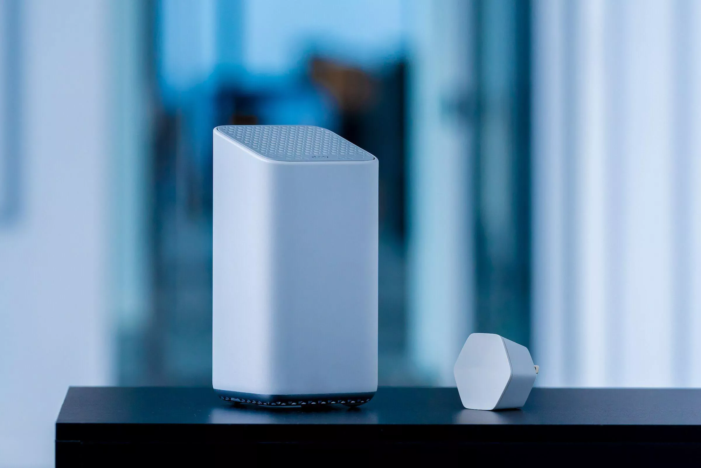

I am a software engineer, working closely with embedded systems. I have worked in all the aspects of embedded software development from low level bootloaders and firmware, to higher level application software for distributed devices and everything in between. I have worked with embedded Linux and also with bare-metal as well as with a a Real Time Operating System (RTOS - vxWorks) on a few different teams for a couple of different successful products, from WiFi to Avionics, with the most successful being [Cisco Catalyst
9115-AX](https://www.cisco.com/c/en/us/products/collateral/wireless/catalyst-9100ax-access-points/datasheet-c78-741988.html), [Comcast Xfinity X6](https://corporate.comcast.com/press/releases/comcast-launches-internet-device-multi-gigabit-speeds-wifi-6) and [General Atomics MQ-9B SkyGuardian Unmanned Aerial Vehicle(UAV)](https://www.ga-asi.com/remotely-piloted-aircraft/mq-9b). Pictures are below:

 
**General Atomics - MQ-9B SkyGuardian**:

   
**Cisco Catalyst 9115 Wifi Access Point**:

   
**Comcast Xfinity X6 Modem**:

## Experience
**Cisco Systems** 
*Software Engineer, March 2021-present*  
**General Atomics Aeronautical Systems** 
*Software Engineer, June 2020-March 2021*. I worked on the team responsible for establishing a satellite data link communication link between the unmanned aerial vehicle(the drone) and the satellite and the ground control station.    
**Embedur Systems** 
*Software Engineer, Fremont, CA, February 2018 – June 2020*. I did-six months to a year long- work contracts with Cisco and Comcast/Commscope where I worked on different products within the WiFi domain.  
**Crocker Nuclear Lab - UC Davis** 
*Electronics Assistant, Davis, May 2017 - Feburary 2018*. Project maintainer and contributer for ongoing science project performing atmospheric pollution measurements with a nationwide network of sampling stations. Member of the Field team responsible for maintaining the software and hardware. My main responsibilities were designing a modern embedded Graphical User Interface(GUI), and adding new features, and fixing bugs and increasing the reliability of the new hardware equipment, that was going to be deployed in the fields all
across the national parks.  
**The Department of Mathematics - UC Davis** 
*Student Researcher, January 2015- September 2015*. Gnarly stuff.

## Skills

**Languages:** C/C++, Python, Golang, Bash  
**Technologies:** Embedded Linx, RTOS, vxWorks, FreeRTOS, TCP/IP  
**Knowledge:** OpenWRT, BitBake, Yocto, Git, Subversion, Device Drivers, Communication Protocols, Linux Operating System, Microcontrollers (MCUs), WiFi, BlueTooth, Avionics, TCAS, Arinc-429, Debugging  
**Soft Skills:** System Design, Troubleshooting and Debugging, Problem Solving, Full System Thinking, Communicating Wel

## Education

**BSc. in Computer Engineering** 
*Department of Electrical and Computer Engineering, University of California, Davis, 2013-2017.*   

## Interests
Besides making cool stuff with computers, I like to both cook and eat food. I am especially proud of my Mediterranean style Tuna recipe. I am also an avid runner. I enjoy running, though not the competitive type of running. When I'm not injured, I usually like to run on hiking trails.

